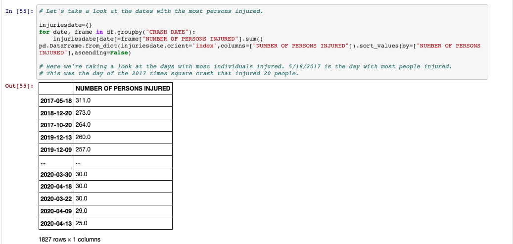

# VehicleCrashNYC_EDA

## Introduction 
This project is an EDA (Exploratory Data Analysis) into NYC's Open Data Motor Vehicle Collisions dataset from 2016-2020. 

## Overview 
- Ran an exploratory data analysis on 4 years and over 1 million instances of vehicle accident data in NYC.
- Delved into topics such as times when most injuries in accidents occur, deadliest years as a result of vehicle accidents, type of roads that feature most accidents etc.
- Used pandas and numpy to clean, wrangle and analyze over 1 million rows and 29 columns of data. 
- Used matplotlib and seaborn to visualize data. 
- Used gmaps package to plot accident densities across the city. 
- 
## Packages and Resources Used
- *Python Version:* 3.7 
- *Packages:* Pandas, Numpy, Gmaps, Matplotlib, Seaborn, Scipy
- *Data Source:* https://data.cityofnewyork.us/Public-Safety/Motor-Vehicle-Collisions-Crashes/h9gi-nx95

## Relevant Findings 

Shows the distrubtion of Daily Vehicle Accidents.[^1]

