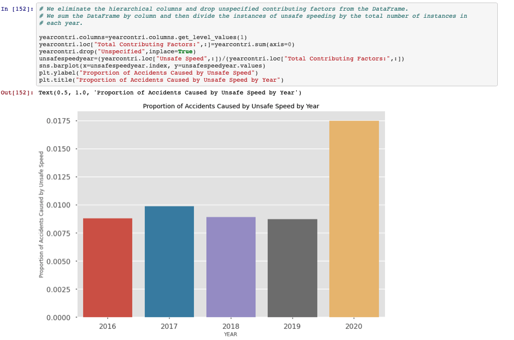

# VehicleCrashNYC_EDA

## Introduction 
This project is an EDA (Exploratory Data Analysis) into NYC's Open Data Motor Vehicle Collisions dataset from 2016-2020. 

## Overview 
- Ran an exploratory data analysis on 4 years and over 1 million instances of vehicle accident data in NYC.
- Delved into topics such as times when most injuries in accidents occur, deadliest years as a result of vehicle accidents, type of roads that feature most accidents etc.
- Used pandas and numpy to clean, wrangle and analyze over 1 million rows and 29 columns of data. 
- Used matplotlib and seaborn to visualize data. 
- Used gmaps package to plot accident densities across the city. 
## Packages and Resources Used
- *Python Version:* 3.7 
- *Packages:* Pandas, Numpy, Gmaps, Matplotlib, Seaborn, Scipy
- *Data Source:* https://data.cityofnewyork.us/Public-Safety/Motor-Vehicle-Collisions-Crashes/h9gi-nx95

## Relevant Findings 

##### Distribution of daily vehicle accidents plotted on a KDE.
-----

##### Distribution of daily vehicle accidents plotted on a boxplot.
-----

#### The average number of accidents tends to peak during during the PM rush hour. 
-----

##### The average number of daily accidents does not seem to follow a specific trend, however, June has the highest rate of daily vehicle accidents while April has the lowest. 
-----

##### Average daily vehicle accidents were flat prior to 2019. 2020 had the lowest rate of accidents due to the COVID-19 pandemic.
-----

##### The highest amount of accidents were recorded on 11-15-2018, during this day the city responded poorly to an unexpected snowstorm. The lowest amount of accidents were reported on 04-05-2020 during the COVID-19 lockdown. 
-----

##### The average amount of daily vehicle accidents grouped by day of the week. Friday features the most average accidents of any day while Sunday features the least. 
-----

##### The total number of fatalities associated with their respective contributing factors are plotted above. Unsafe speed is unsurpsingly at the top of this list. 
------

##### The contributing factors in vehicle accidents sorted by their repsective counts. 
-----

##### Deaths by hour measured on a per accident basis. Deaths per accident increase significantly during the late night/early morning hours. This is likely due to an increase in the proportion of accidents caused by Unsafe Speed. 
-----

##### Here we confirm that unsafe speeding makes up a greater proportion of accidents during the late night/early morning hours. Little vehicle traffic is likely the cause of this. 
-----

##### Here deaths are calculated on a per accident basis and grouped by day of the week. The weekend features higher deaths per accidents. 
-----

##### This plot showing deaths per accident by year shows that 2020 had significantly higher amounts of fatalities per accident. Roads with less traffic likely led to higher levels of speed. 
-----

##### From this plot we can confirm that the proportion of unsafe speeding was significantly higher in 2020 when compared to the other years. This plot almost perfectly mimicks the trend seen in the plot of Deaths per Accident by Year.
-----

##### Despite having the least amount of accidents, 2020 has the most fatalties resulting from vehicle accidents.  
-----

##### 10-31-2017 was the deadliest day for vehicle accidents in recent years with 10 fatalities. Uncoincidentally, the 2017 New York City Truck Attack took place on this day.  
-----

##### This plot shows the number of injuries per accident by Borough, in which Mahattan has the lowest rate while Brookyln has the highest. 
-----

##### Much like the trends seen in the deaths per accident by hour, the number of injuries per accident per hour tend to be higher in the late night/early mornings.
-----

##### Injuries per accident are higher on weekends and pretty constant during weekdays.
----

##### Total number of injuries tend to peak with warmer weather and then taper off into the winter. 
-----

##### The date with most car vehicle injuries was on 05-18-2017, a car who had run into a times square crowd inflated these numbers.
-----

##### In an attempt to answer which road type is the deadliest, this plot features fatalties per accident by Road/Street Type. Turnpikes appear to have a significantly higher rate, followed by Boulevards.
-----

##### Growing up next to Queens Boulevard, I remember when it was coined the term "The Boulevard of Death." Here we gain some insight into which roads/streets/highways etc. are the deadliest in recenty years. The Grand Central Parkway in on the top of this list with 22 fatalities in the last 5 years. 
-----

##### Here we are taking a look at the number of accidents in each neighborhood. Hell's Kitchen/Midtown Manhattan takes the cake, however, it should be noted that this neighborhood covers a wide range of zip codes.
-----
Solarized dark             |  Solarized Ocean
:-------------------------:|:-------------------------:
  |  
