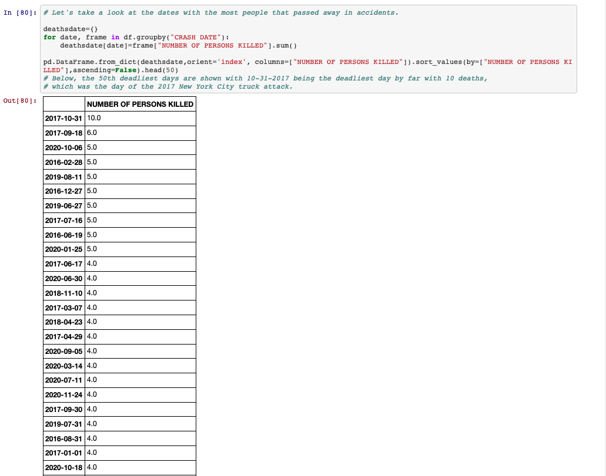
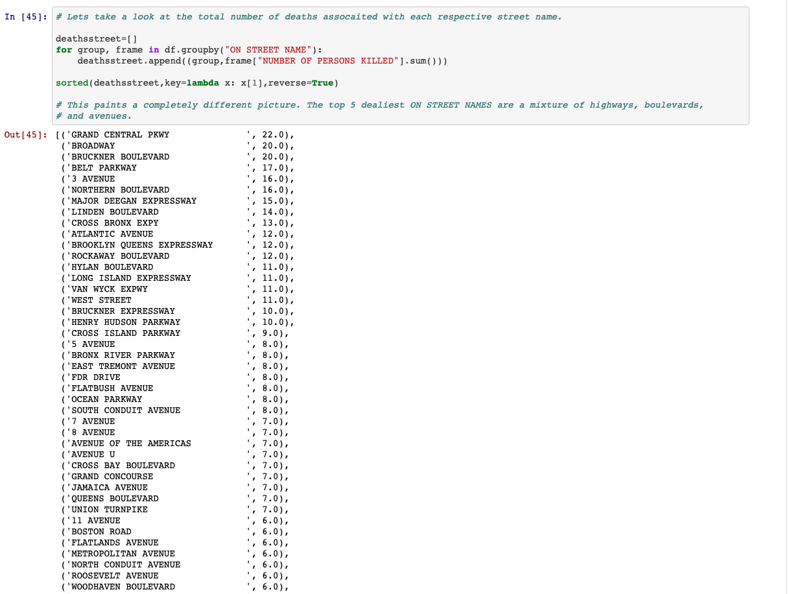

# VehicleCrashNYC_EDA

## Introduction 
This project is an EDA (Exploratory Data Analysis) into NYC's Open Data Motor Vehicle Collisions dataset from 2016-2020. 

## Overview 
- Ran an exploratory data analysis on 4 years and over 1 million instances of vehicle accident data in NYC.
- Delved into topics such as times when most injuries in accidents occur, deadliest years as a result of vehicle accidents, type of roads that feature most accidents etc.
- Used pandas and numpy to clean, wrangle and analyze over 1 million rows and 29 columns of data. 
- Used matplotlib and seaborn to visualize data. 
- Used gmaps package to plot accident densities across the city. 
## Packages and Resources Used
- *Python Version:* 3.7 
- *Packages:* Pandas, Numpy, Gmaps, Matplotlib, Seaborn, Scipy
- *Data Source:* https://data.cityofnewyork.us/Public-Safety/Motor-Vehicle-Collisions-Crashes/h9gi-nx95

## Relevant Findings 

##### Distribution of daily vehicle accidents plotted on a KDE.
---

##### Distribution of daily vehicle accidents plotted on a boxplot.
---

##### The average amount of daily vehicle accidents grouped by day of the week. Friday features the most average accidents of any day while Sunday features the least. 
---

##### The total number of fatalities associated with their respective contributing factors are plotted above. Unsafe speed is unsurpsingly at the top of this list. 
------

##### The contributing factors in vehicle accidents sorted by their repsective counts. 
-----

##### Deaths by hour measured on a per accident basis. Deaths per accident increase significantly during the late night/early morning hours. This is likely due to an increase in the proportion of accidents caused by Unsafe Speed. 
-----

##### Here we confirm that unsafe speeding makes up a greater proportion of accidents during the late night/early morning hours. Little vehicle traffic is likely the cause of this. 
-----

##### Here deaths are calculated on a per accident basis and grouped by day of the week. The weekend features higher deaths per accidents. 
-----

##### This plot showing deaths per accident by year shows that 2020 had significantly higher amounts of fatalities per accident. Roads with less traffic 

